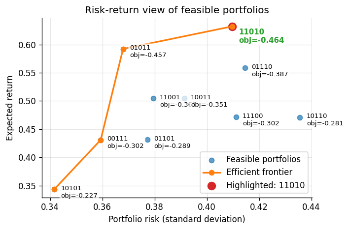
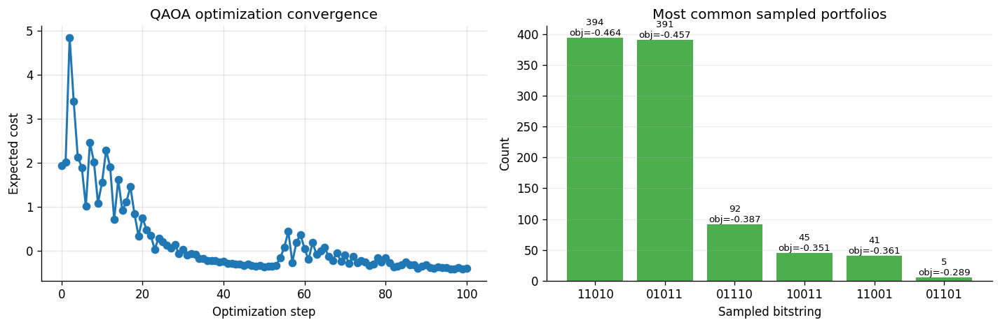
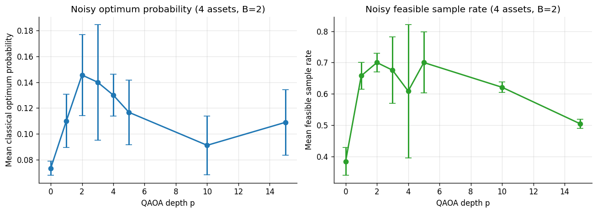
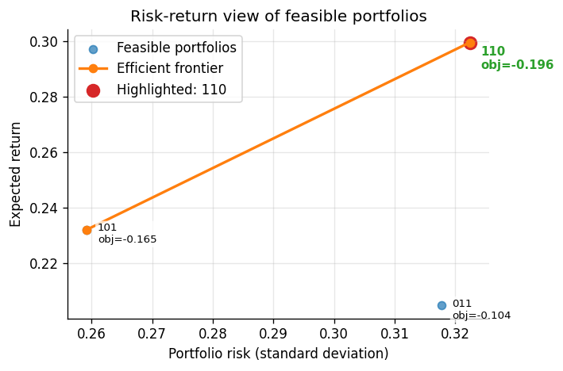
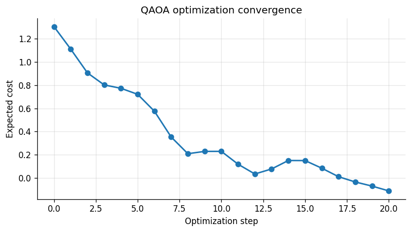
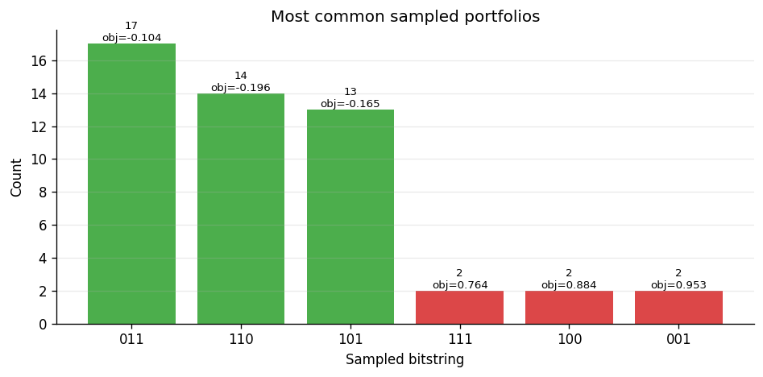

# QAOA Portfolio Optimization

This project explores the Quantum Approximate Optimization Algorithm (QAOA) for binary mean-variance portfolio optimization. The work maps a constrained portfolio-selection problem into a penalized QUBO, converts it to an Ising cost Hamiltonian, and compares ideal PennyLane simulation, noisy simulation, and IBM Qiskit hardware execution.

[Read the full project report](./Exploring%20QAOA%20for%20Portfolio%20Optimization.pdf)

## Results

The portfolio objective is

```text
min q x^T Sigma x - mu^T x
subject to exactly B selected assets.
```

The budget constraint is folded into the objective with a penalty term, then encoded with `x_i = (1 - Z_i) / 2` so QAOA can search over portfolio bitstrings.



**Figure 1.** Feasible portfolios for a 5-asset, budget-2 instance. The orange curve marks the efficient frontier, and the highlighted portfolio `11010` is the best choice once the risk-aversion parameter is fixed.



**Figure 2.** Ideal PennyLane QAOA on the 5-asset instance. The expected cost decreases during optimization, and the final sampled distribution concentrates on the two strongest feasible portfolios: `11010` and `01011`.



**Figure 3.** Noisy PennyLane depth study for a 4-asset, budget-2 case. Moderate QAOA depth performs best under depolarizing noise; deeper circuits lose both optimum probability and feasible sample rate.



**Figure 4.** Feasible portfolios for the 3-asset instance used in the IBM hardware workflow. The highlighted portfolio `110` is the classical optimum under the selected objective.



**Figure 5.** IBM hardware-in-the-loop optimization on the 3-asset problem. The expected cost trends downward, but the trajectory is much more volatile than the simulator runs.



**Figure 6.** Final IBM hardware samples for the 3-asset problem. Feasible portfolios dominate the distribution, but the worst feasible portfolio appears most often and several infeasible states remain visible.

## Takeaways

- Ideal simulation can place most probability mass on high-quality feasible portfolios.
- Noise changes the depth tradeoff: larger `p` is not automatically better.
- Real hardware execution works for the small 3-asset case, but finite shots, noisy optimization, and transpilation overhead make the workflow fragile.
- The 3-qubit IBM circuit transpiled into a substantially deeper hardware circuit, showing that logical QAOA depth understates device-level cost.

## Repository Layout

```text
.
|-- Exploring QAOA for Portfolio Optimization.pdf
|-- portfolio_qaoa_core.py
|-- requirements.txt
|-- figures/
|-- IBM/
|   |-- ibm.ipynb
|   `-- portfolio_qaoa_qiskit.py
`-- pennylane/
    |-- pennylane.ipynb
    `-- portfolio_qaoa_pennylane.py
```

